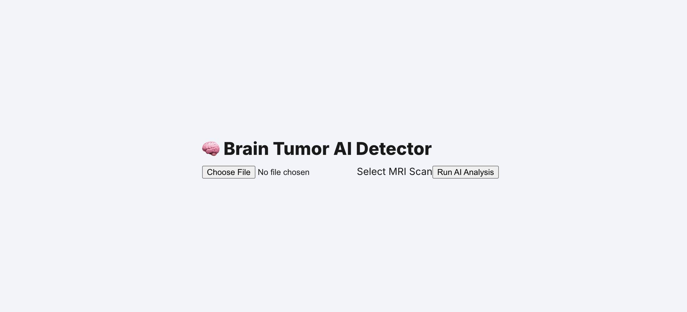
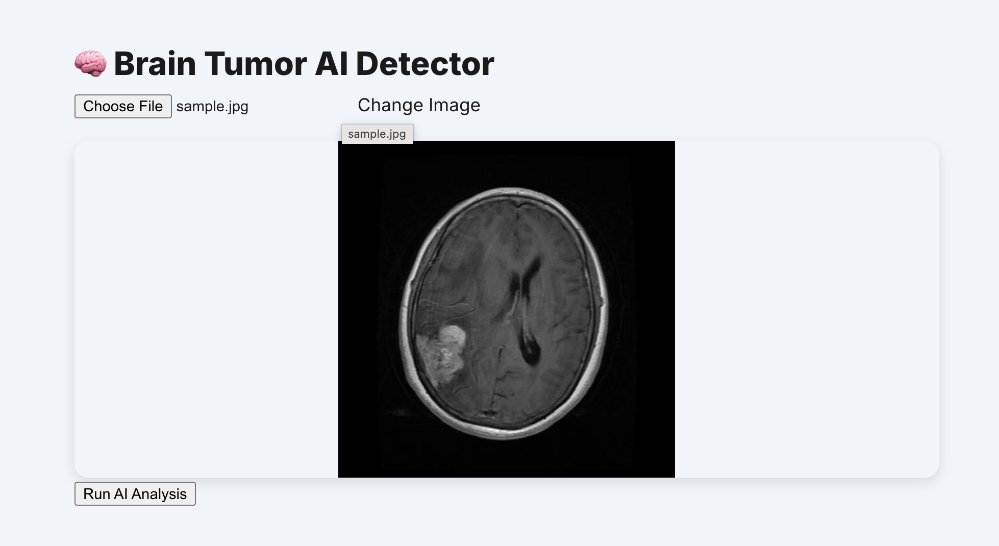
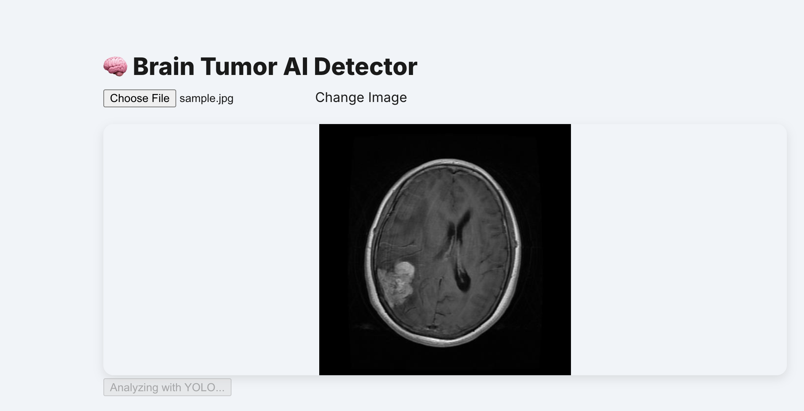
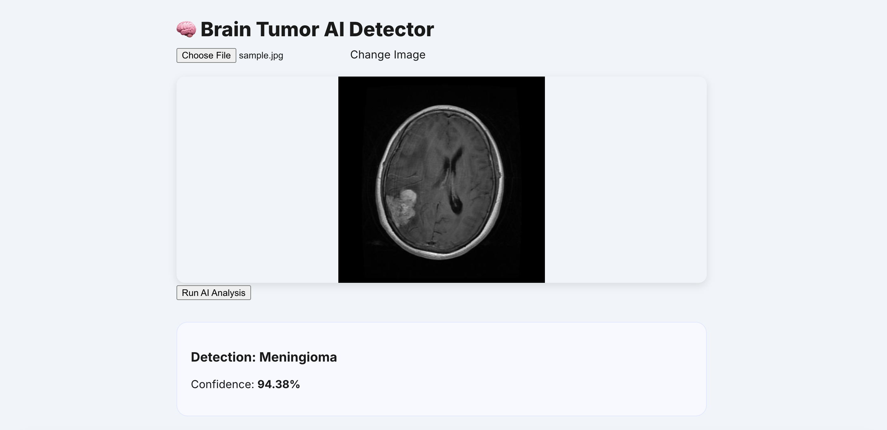

## NeuroScan AI: Brain Tumor Object Detection
A full-stack medical imaging application that leverages the YOLO (You Only Look Once) architecture to classify brain MRI scans into four categories: Glioma, Meningioma, Pituitary, or No Tumor.

NeuroScan AI provides a professional, user-friendly interface for clinicians to upload MRI scans and receive instant, high-confidence AI analysis.

### Features
- **Real-time AI Inference:** Fast classification using a custom-trained YOLO model.

- **Detailed Probabilities:** Provides confidence scores for each tumor type.

- **Medical Grade UI:** Clean, responsive React interface with image previewing.

- **Automated Cleanup:** Server-side file management to ensure patient data privacy.

- **Cross-Platform Bridge:** Seamless communication between Node.js and Python Virtual Environments.

### Tech Stack

- **Frontend:** React.js, CSS3 (Glassmorphism design)

- **Backend:**  Node.js, Express.js

- **AI/ML:**  Python, YOLO (Ultralytics), PyTorch

- **Communication:**  Child Process Spawning (Node-to-Python bridge)

- **File Handling:**  Multer (Disk Storage)

## Installation and Set up
1. **Clone The Repository**
```bash
git clone git@github.com:carlos-marin1742/BrainTumorObjectDetection.git
```
2. **Set Up the AI Environment**
```bash
# Create the virtual environment
python3 -m venv brain_tumor_env

# Activate the environment
source brain_tumor_env/bin/activate  # On Mac/Linux
# brain_tumor_env\Scripts\activate   # On Windows

# Install dependencies
pip install -r requirements/txt
```
3. **Set Up The Backend**
```bash
#From the root directory
npm install
```

4. **Set Up The frontend**
```bash
cd frontend
npm install
```
## Usage and running the full stack
1. **Start Backend:** in the root directory, run ``node server.js``.
2. **Start Frontend** in the ``frontend`` directory, run ``npm start``
3. **Analyze:** Open ``http://localhost:3000`` in your browser, upload an MRI image(JPG/PNG), and click "Start AI Analysis.

## Image Examples
**Initial Screen**

**Uploading Image**

**Analyzing Screen**

**Results**


## API Endpoints
``POST /analyze-mri``

Processess an MRI Image and returns classification results
- **Payload:** multipart/form-data

- **Key:** mri-image (File)

- **Success Response:**
```json

{
    "status": "success",
    "detections": [
        {
            "label": "Pituitary",
            "confidence": 95.41
        }
    ]
}
```


## Roadmap
- **[ ] DICOM Support:** Direct processing of hospital-standard DICOM files.

- **[ ] Heatmaps:** Integration of Grad-CAM to show where the AI sees the tumor.

- **[ ] PDF Reporting:** Generate a downloadable clinical report.

- **[ ] Patient History:** Database integration (MongoDB) to track scan history.

## Contributing
1. Fork the Project.

2. Create your Feature Branch (``git checkout -b feature/NewFeature``).

3. Commit your Changes (``git commit -m 'Add some NewFeature'``).

4. Push to the Branch (``git push origin feature/NewFeature``).

5. Open a Pull Request.


## Author
**Author**: Carlos Marin
